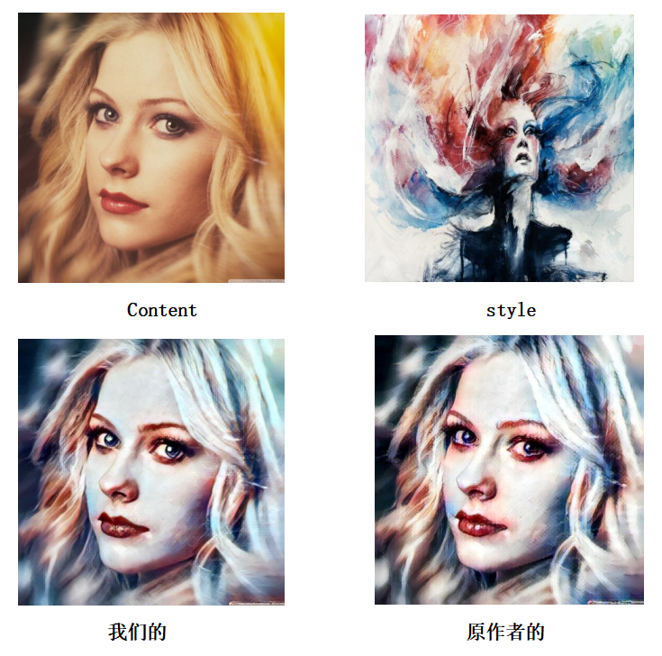
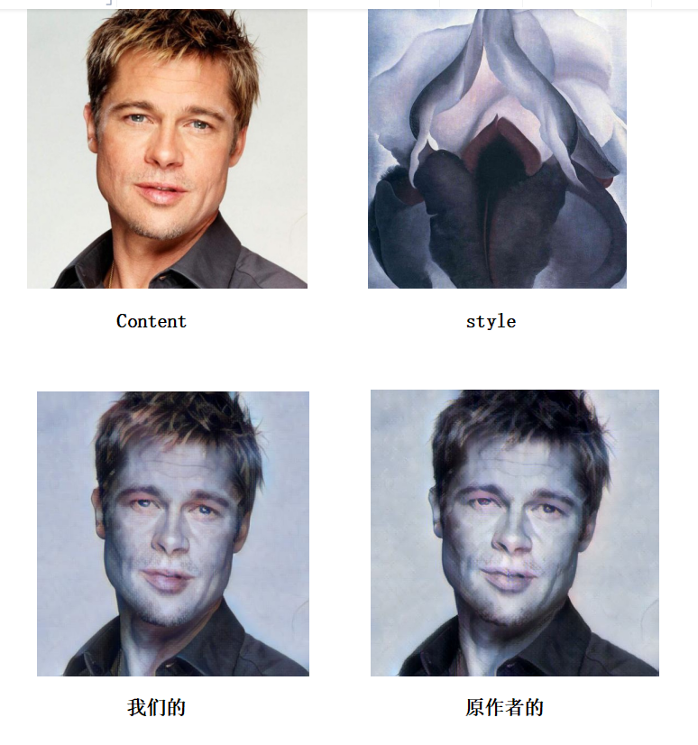
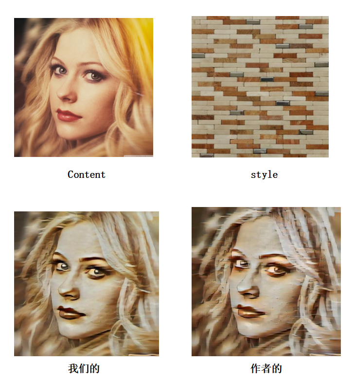
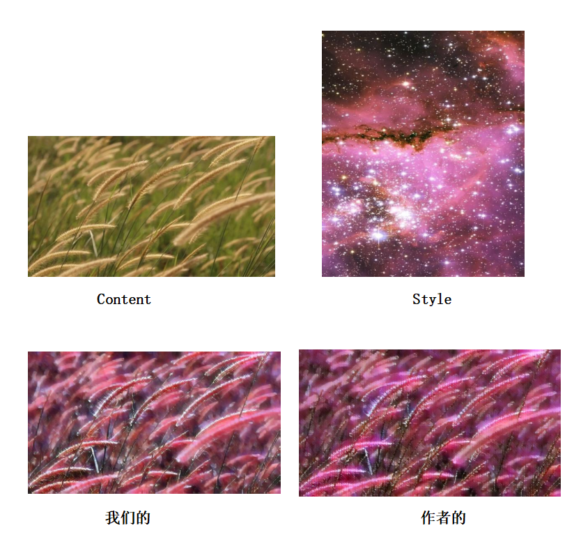
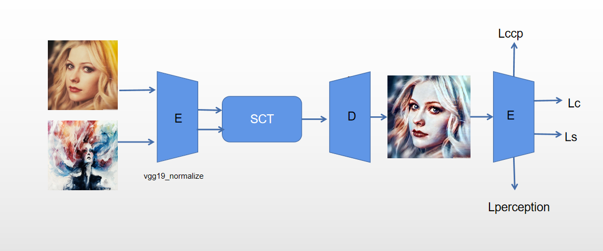
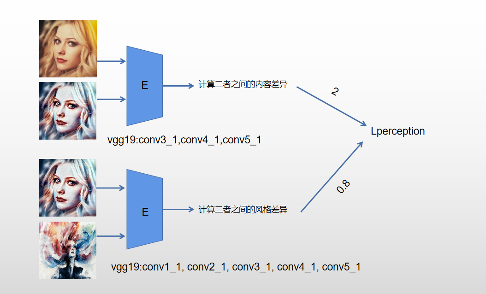

# Video-transfer-based-on-CCPL
This is a project that will help you convert a video or image into a variety of styles

我们的模型并非完全原创，而是根据GitHub优秀的开源作者提供的模型做出改良而成的，原作者的GitHub网址[CCPL+SCTNet模型源地址](https://github.com/JarrentWu1031/CCPL)
# 一、模型风格迁移效果展示
## 1.1 人物图（多色彩方面迁移）

原作者的图会在左边嘴角出现局部的蓝色色块，但这显然与右边脸颊的蓝色色块不对等，而我们的模型没有出现这个问题，同时在眼睛方面，我们的图片清晰度明显比原作者的图片要好。

## 1.2 人物图（单一色彩方面迁移）

在风格方面，我们的和原作者的相差不大，但是我们的图片在表现力方面要比原作者的图片强，从眼睛这块就可以看出来，我们的眼睛要比原作者更有灵性。

## 1.3 人物图（有纹理干扰的迁移）

原作者的模型在艺术模式下风格化程度过高，在脸部也都出现了部分砖块纹理，而我们的模型在脸部仍保留了大部分的脸部信息，清晰度高，当然，对于这种评价问题，各有各的喜好，本文只是阐述我们的新模型在哪些方面是超过原作者的。

## 1.4 风景图

我们的图片色彩相比原作者更加柔和，同时清晰度更高，有些狗尾草的局部细节也能体现出来。

## 1.5 视频风格迁移差异

以下会展示我们模型所有的视频风格迁移模式。

### 1.5.1 原作者的艺术级风格迁移模式

### 1.5.2 我们的艺术级风格迁移模式

### 1.5.3 原作者的照片级风格迁移模式

以上三种模式就是我们的视频风格迁移模型提供的三种可选择模式，其中有两种模式用的都是原作者提供的模型，因为我们自己训练出来的照片级风格迁移模式和原作者的没有太大区别，所以不做展示，就只展示我们自主训练出来的艺术级风格迁移模式。

# 二、模型创新
## 2.1 创新的原因
原作者提供的模型做出的突出贡献主要提出了一个新的损失函数CCPL，减轻了视频迁移方面对输入图片的一些严格约束，使得用单幅图片训练出来的模型也能取得和用视频帧训练出来的图片取得差不多的效果，但是该模型在艺术级模式上存在一些风格迁移过度和不合理的地方，于是就有了我们的创新点，我们希望再训练一个模型，实现风格化程度和艺术级相差不大，但是生成图片的内容信息更加清晰细腻，并且消除一些不合理的风格化。
## 2.2 创新的方式
通过阅读相关的论文，我们在训练模型中加入感知损失模块。我们将VGG19模型的某些层作为该感知损失模块的图片特征提取器，用提取到的特征计算相应的损失，并将这些损失加入到总的损失函数中，通过该损失函数调节融合网络SCTNet中的参数，从而改变不同风格特征和内容特征的融合结果，最终实现不一样风格迁移的效果。
## 2.3 创新模式的架构图

第一个部分介绍的是在总的模型中加入了感知损失函数，第二个部分介绍了这个感知损失函数是怎么构成的。

# 三、训练环境和配置

我们使用的是学校提供的深度学习算力资源训练，环境是Linux（Ubuntu），训练数据是来自kaggle官网提供的数据的一部分，大约内容图片3G，风格图片5G。但是如果只是使用我们的模型可以直接使用windows操作系统，用pycharm编辑器，pytorch1.11.0版本即可调用我们提供的模型进行风格迁移。

# 四、总结
风格迁移结果具有很大的主观性，没有绝对的评价指标说哪一种结果好，哪一种结果不好，我创新的目的出发点就是创造出一个与原作者不一样且符合我风格的模型出来，所以我的模型会偏向于色彩柔和，内容较清晰，但又具备一定程度的风格化。在这个总的模型里，我们提供了三份模型，供用户根据自己的喜好进行迁移，提高了模型的灵活性。注意，如果想使用原作者的代码训练，请到他的网址下载模型，我提供的代码是我改良之后的模型，与原模型不一致。

# 五、致谢
感谢原作者秉持开源精神提供的源代码，同时也感谢老师提供的指导。
